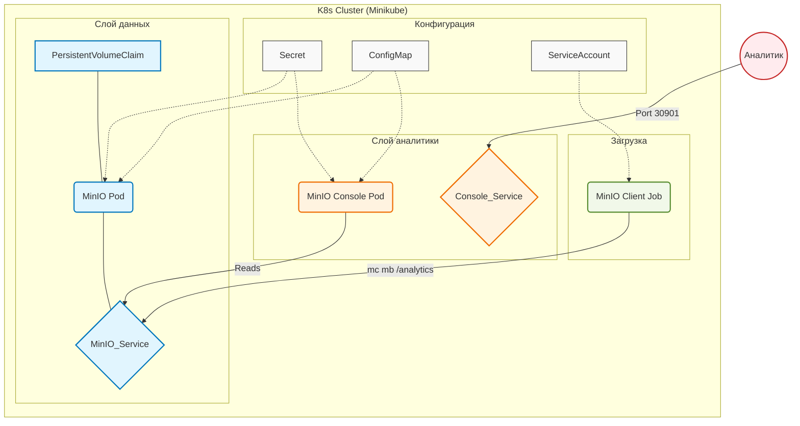

# Лабораторная работа №3 Развертывание приложения в Kubernetes


**Выполнила**: Пришлецова Кристина Сергеевна

**Группа**: АДЭУ-221

**Вариант**: 11

| Основной сервис (App) | Вспомогательный сервис (DB/Tool) | Задача |
| :--- | :---: | :---: |
| MinIO | MinIO Client (Job) | Развернуть S3-хранилище MinIO. Открыть доступ к консоли. Опционально: запустить Job, создающий бакет. |

---

## 1. Цель работы
Освоить процесс оркестрации контейнеров. Научиться разворачивать связки сервисов (аналитическое приложение + база данных/интерфейс) в кластере Kubernetes, управлять их масштабированием (Deployment) и сетевой доступностью (Service).

## 2. Технический стек и окружение
- **ОС**: Ubuntu 24.04 LTS 
- **Контейнеризация**: Docker 24.x
- **Оркестрация**: Minikube
- **Инструмент управления**: kubectl с алиасом aliac kubectl='microk8s kubectl'
- **Основной сервис (App)**: MinIO S3-совеместимое объектное хранилище
- **Вспомогательный сервис**: MinIO Client (mc) в виде Kubernetes Job
- **Доступ к консоли**: MinIO Console веб-интерфейс на порту 9001
- **Хранение данных**: hostPath или PVC для сохранения объектов MinIO

---

## 3. Архитектура решения


## Таблица пояснения компонентов архитектуры
| Блок | Компонент | Краткое пояснение |
|:----:|-----------|-------------------|
| **Configs** | Secret / ConfigMap / ServiceAccount | Secret хранит пароли MinIO. ConfigMap содержит конфигурацию подключения. ServiceAccount дает права MinIO Client Job на создание бакета. |
| **Data** | PVC / MinIO Pod / MinIO_Service | PVC для постоянного хранения объектов. MinIO Pod — S3-хранилище (порты 9000/9001). MinIO_Service для внутреннего доступа. |
| **Analytics** | MinIO Console Pod / Console_Service | Веб-интерфейс для управления бакетами и объектами. Console_Service (NodePort) открывает доступ наружу на порт 30901. |
| **Load** | MinIO Client Job | Однократный процесс, выполняющий `mc mb` для создания бакета `analytics`. |
| **User** | Аналитик | Внешний пользователь, заходящий в MinIO Console через браузер по адресу `http://<IP-ВМ>:30901`. |

---

## 6. Порядок выполнения работы
**Запуск**: ```minikube start --driver=docker```
