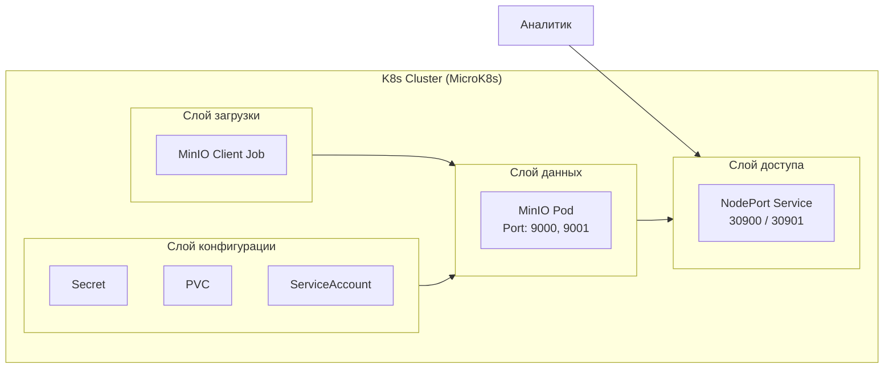

# Лабораторная работа №3 Развертывание приложения в Kubernetes

**Выполнила**: Пришлецова Кристина Сергеевна

**Группа**: АДЭУ-221

**Вариант**: 11

| Основной сервис (App) | Вспомогательный сервис (DB/Tool) | Задача |
| :--- | :---: | :---: |
| MinIO | MinIO Client (Job) | Развернуть S3-хранилище MinIO. Открыть доступ к консоли. Опционально: запустить Job, создающий бакет. |

---

## 1. Цель работы
Освоить процесс оркестрации контейнеров. Научиться разворачивать связки сервисов (аналитическое приложение + база данных/интерфейс) в кластере Kubernetes, управлять их масштабированием (Deployment) и сетевой доступностью (Service).

## 2. Технический стек и окружение
- **ОС**: Ubuntu 24.04 LTS 
- **Контейнеризация**: Docker 24.x
- **Оркестрация**: MicroK8s/Minikube !!Не забудь тут одно из двух выбрать!!
- **Инструмент управления**: kubectl с алиасом aliac kubectl='microk8s kubectl'
- **Основной сервис (App)**: MinIO S3-совеместимое объектное хранилище
- **Вспомогательный сервис**: MinIO Client (mc) в виде Kubernetes Job
- **Доступ к консоли**: MinIO Console веб-интерфейс на порту 9001
- **Хранение данных**: hostPath или PVC для сохранения объектов MinIO

---

## 3. Архитектура решения

 

