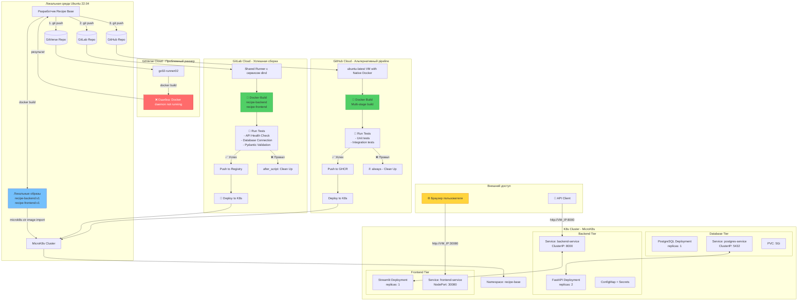

# Лабораторная работа 4.1. Создание и развертывание полнофункционального приложения

**Выполнила**: Пришлецова Кристина Сергеевна

**Группа**: АДЭУ-221

**Вариант**: 11

| Название системы | Бизнес-задача | Данные (Пример) |
| :--- | :---: | :---: |
| Recipe Base | База знаний (рецептов/алгоритмов). | Название, ингредиенты/шаги, автор, время приготовления. |

---

## 1. Цель работы
Применить полученные знания по созданию и развертыванию трехзвенного приложения (Frontend + Backend + Database) в кластере Kubernetes. Научиться организовывать взаимодействие между микросервисами.

## 2. Архитектура решения

